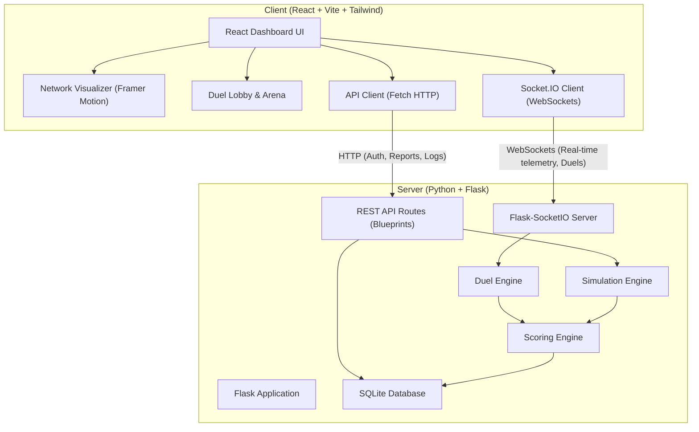

# CyberShield — Interactive Cyber Warfare & Cryptography Platform

CyberShield is an immersive, real-time web-based simulation platform designed to demonstrate cyber attacks and cryptography-based defensive controls. Built with a responsive dark-mode Security Operations Center (SOC) aesthetic, it provides operators with a visual, dual-perspective representation of networks under siege and cryptographic shields in action.

---

## Architecture Flow

The following diagram illustrates the interactive architectural flow between the React + Vite frontend and the Flask + SQLite + Socket.IO backend:



---

## Core Features

- **Interactive Network Visualizer**: An animated 2D canvas mapping client-attacker-server connections. Packet directions dynamically shift, representing data flows and attacker intercepts in real-time.
- **Scenario Simulator**: Simulate various network attack vectors (e.g., Man-in-the-Middle, Replay Attacks, Credential Brute Forcing, Packet Sniffing) and toggle cryptographic countermeasures (e.g., TLS encryption, nonce validation, lockout policies).
- **Gamified 2-Player Duels**: Live gamified "Attacker vs. Defender" modes synced in real-time over WebSockets, allowing two operators to compete, score points, and earn bonus experience (XP).
- **Live Leaderboard & Auditing**: Experience-based profiling and logging of simulations, complete with downloadable audit reports.
- **Explain Mode**: Educational breakdowns detailing how the specific cryptography algorithms (like Diffie-Hellman, AES, RSA, Nonces) prevent the active attack vectors.

---

## Directory Structure

```
CyberShield/
├── backend/
│   ├── app/
│   │   ├── routes/             # REST endpoints (Authentication, Duels, Leaderboard)
│   │   ├── simulation_engine/  # Attack-defense simulation logic
│   │   ├── scoring_engine.py   # XP and Rank system calculations
│   │   └── socketio_server.py  # Socket.IO WebSocket endpoints
│   ├── run.py                  # Main entry point to launch backend server
│   └── requirements.txt        # Python backend dependencies
│
└── frontend/
    ├── src/
    │   ├── components/         # React dashboard widgets and visualizers
    │   ├── hooks/              # Custom React hooks (real-time listeners, duels)
    │   ├── App.jsx             # Main dashboard shell & routing controller
    │   └── index.css           # CSS design system (SOC colors, scrollbars)
    ├── package.json            # Node.js dependencies
    └── vite.config.js          # Vite compilation config
```

---

## Setup & Running the Project

### Prerequisites
- **Python 3.8+**
- **Node.js 16+**

### Running the Backend
1. Navigate to the backend directory:
   ```bash
   cd backend
   ```
2. Create and activate a virtual environment (optional but recommended):
   ```bash
   python -m venv venv
   # On Windows:
   .\venv\Scripts\activate
   # On macOS/Linux:
   source venv/bin/activate
   ```
3. Install the required dependencies:
   ```bash
   pip install -r requirements.txt
   ```
4. Start the backend Flask server (will listen on `http://127.0.0.1:5000`):
   ```bash
   python run.py
   ```

### Running the Frontend
1. Navigate to the frontend directory:
   ```bash
   cd ../frontend
   ```
2. Install Node.js dependencies:
   ```bash
   npm install
   ```
3. Launch the Vite development server (accessible via `http://localhost:5173`):
   ```bash
   npm run dev
   ```

---

## Git & GitHub Workflow

When working with this platform:
1. **Local Sandbox**: As your AI assistant, any code changes I perform are saved **directly to your local files** in this directory.
2. **Pushing to Github**: I do **not** automatically run `git push` to your GitHub remote. You will have to execute the push command yourself once you have reviewed the local code. Alternatively, you can ask me to run a git push command for you in the terminal.

To push all current changes to GitHub, you can run:
```bash
git add .
git commit -m "feat: complete premium UI restoration and visualizer fixes"
git push origin main
```
